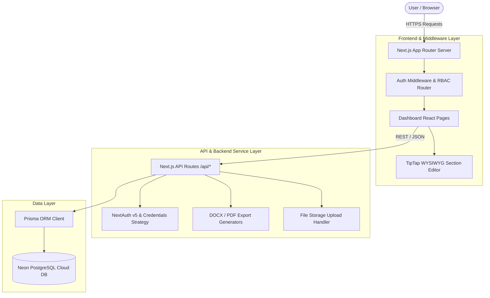
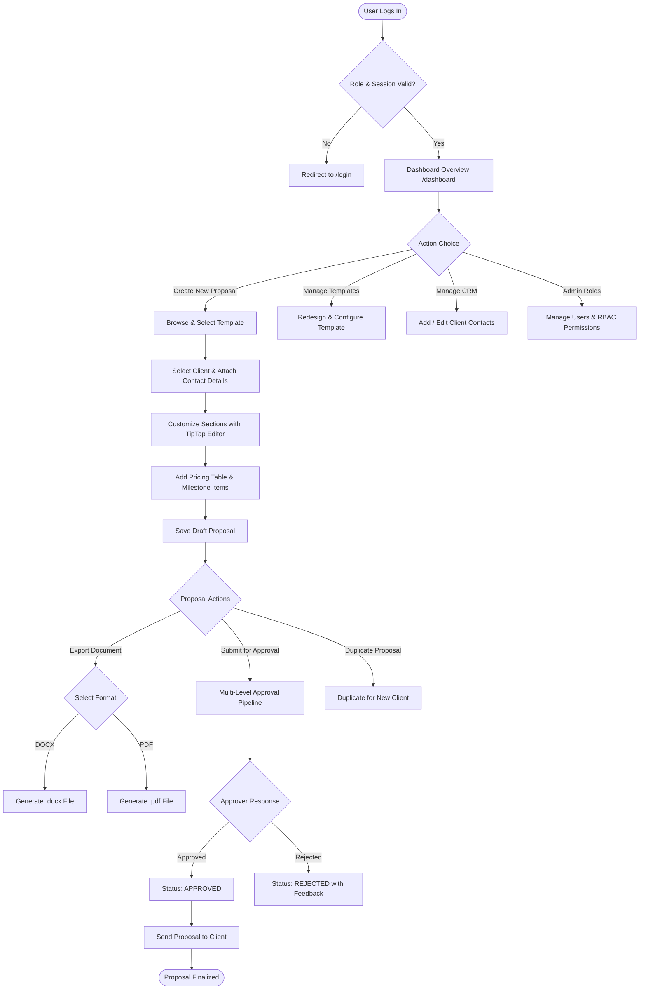
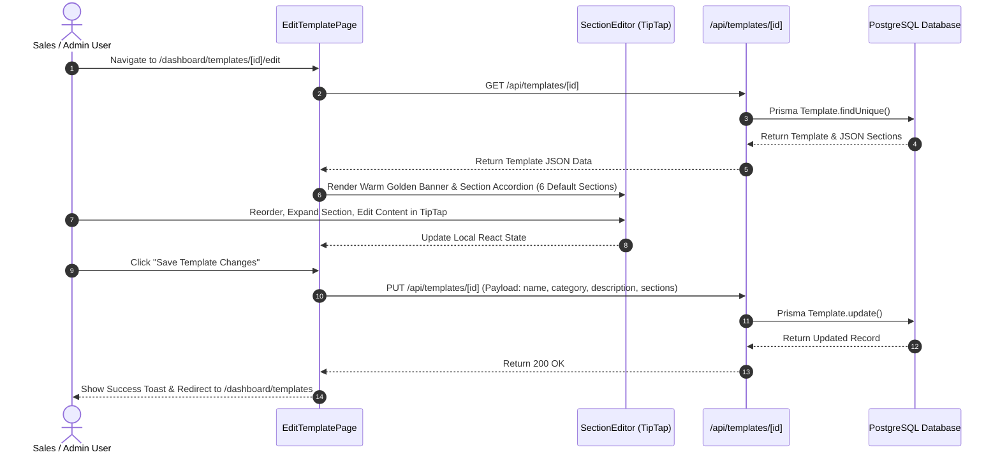
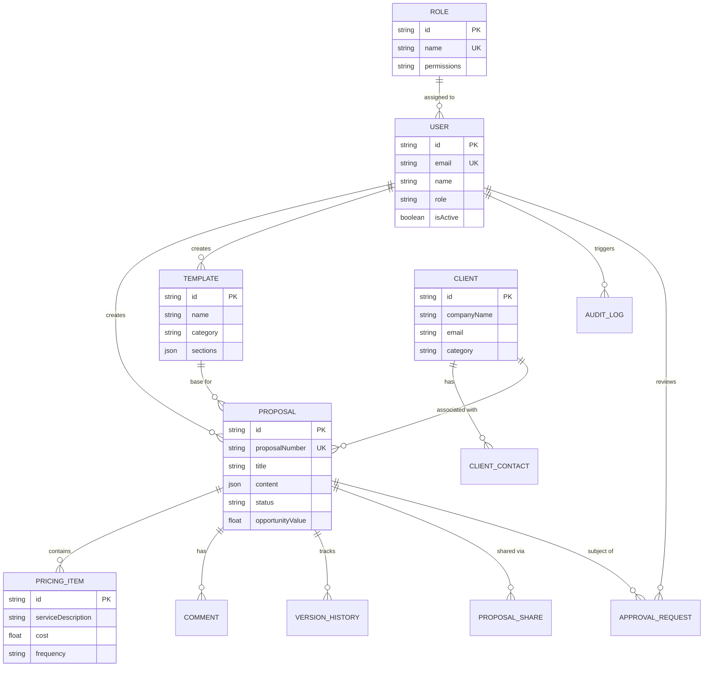

# Interactive Bees — Enterprise Proposal Builder Workflow & System Architecture

This document provides a comprehensive end-to-end overview of the **Interactive Bees Proposal Builder** platform architecture, data model, user journeys, multi-level approval workflows, and page navigation map.

---

## 1. High-Level Architecture Overview

The system is built as a modern, high-performance full-stack Next.js application utilizing PostgreSQL as the relational data layer, Prisma ORM, NextAuth.js for session and role management, and TipTap for rich text editing.

---

## 2. Complete User Workflow & Lifecycle Flowchart

### 2.1 End-to-End Proposal Creation & Delivery Lifecycle

---

## 3. Detailed Component Flow & Module Interactions

### 3.1 Template Editing & Accordion Section Workflow

---

## 4. Entity-Relationship Diagram (Database Schema)

---

## 5. Page Navigation & Route Map

| Route Path | Description | Access Level |
| :--- | :--- | :--- |
| `/login` | Authentication Login & Credentials Form | Public |
| `/dashboard` | Executive Dashboard Metrics & Recent Proposals | All Authenticated Roles |
| `/dashboard/proposals` | Proposal List, Filters, Status Badges, & Search | All Authenticated Roles |
| `/dashboard/proposals/new` | Create Proposal Wizard & Template Selector | Sales, Admin, Owner |
| `/dashboard/proposals/[id]` | Proposal Detail, TipTap Editor, Pricing & PDF/DOCX Export | All Authenticated Roles |
| `/dashboard/templates` | Proposal Template Library Grid & Category Filters | Sales, Admin, Owner |
| `/dashboard/templates/[id]/edit` | Redesigned Template Accordion Editor with Warm Golden Hero Banner | Admin, Owner |
| `/dashboard/clients` | Client CRM Directory, Contacts, & Company Overview | Sales, Admin, Owner |
| `/dashboard/content-library` | Reusable Content Snippets & Scope Modules | Business Expert, Admin |
| `/dashboard/asset-library` | Brand Logos, Media Assets & Document Files | All Authenticated Roles |
| `/dashboard/users` | User Directory Management & Status Toggles | Owner, Admin |
| `/dashboard/roles` | Role-Based Access Control (RBAC) Permission Matrix | Owner, Admin |
| `/dashboard/settings` | Company Settings, Branding & Default Terms | Admin, Owner |

---

## 6. Key Features Summary

1. **Warm Golden Enterprise UI/UX**:
   - Uniform design tokens featuring curated warm gold banners, responsive card layouts, handwritten brand callouts (*"we believe. we can."*), and crisp typography.

2. **TipTap Rich Text Section Editor**:
   - WYSIWYG section builder with custom typography, font sizing, alignment, list controls, tables, code blocks, and drag-and-drop section ordering.

3. **Multi-Level Approval Engine**:
   - Structured multi-stage approval flow (Sales, Technical, Finance, Management) with automated status tracking.

4. **Multi-Format Export**:
   - Native DOCX document generation and PDF export capabilities preserving proposal formatting and pricing structures.

5. **PostgreSQL Cloud Storage**:
   - Powered by Neon PostgreSQL cloud database with full version history snapshots and audit logging.
